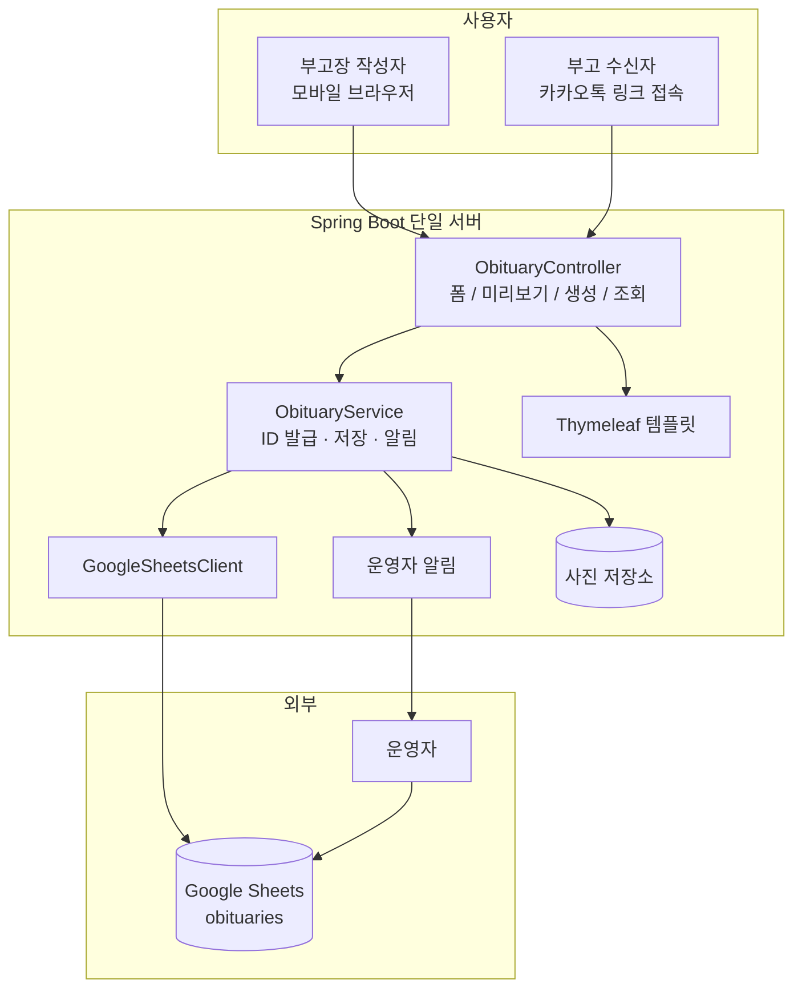
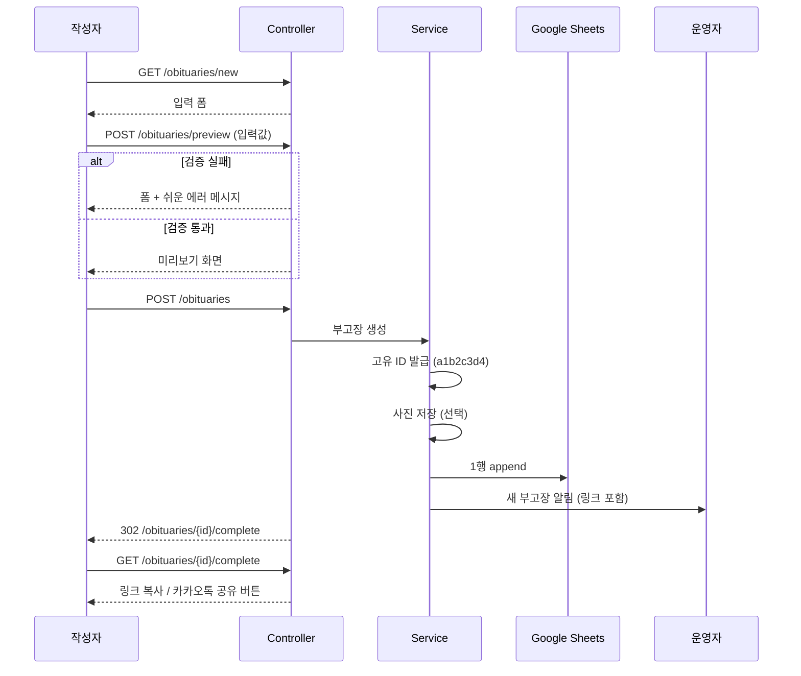
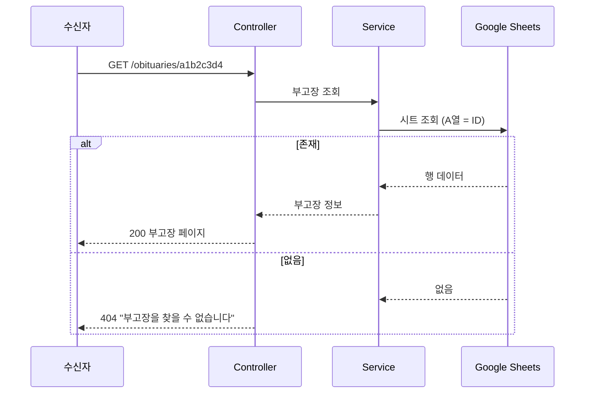
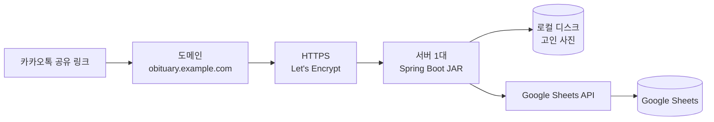

# 데이터 양식 & 아키텍처

MVP 기준. 데이터 저장소는 Google Sheets 하나, 애플리케이션은 Spring Boot 단일 서버다.
필드 이름과 예시는 [api.md](./api.md)와 동일하게 맞춘다.

---

## 1. Google Sheets 저장 양식

### 스프레드시트 구성

| 항목 | 값 |
|---|---|
| 스프레드시트 | `부고장 관리` |
| 시트(탭) | `obituaries` |
| 1행 | 헤더 (고정) |
| 2행부터 | 부고장 1건 = 1행, 생성 순서대로 append |

### 컬럼

| 열 | 컬럼명 | 필드 | 필수 | 예시 |
|---|---|---|---|---|
| A | 부고장ID | id | O | `a1b2c3d4` |
| B | 생성일시 | createdAt | O | `2026-08-15 14:32:10` |
| C | 고인성함 | deceasedName | O | `홍길동` |
| D | 별세일 | deathDate | O | `2026-08-14` |
| E | 장례식장 | funeralHall | O | `서울추모공원` |
| F | 빈소 | mortuaryRoom | O | `3호실` |
| G | 발인일 | coffinOutDate | O | `2026-08-16` |
| H | 상주이름 | chiefMournerName | O | `홍철수` |
| I | 상주연락처 | chiefMournerPhone | O | `010-1234-5678` |
| J | 고인사진 | photoUrl | X | `/images/a1b2c3d4.jpg` |
| K | 장례식장주소 | funeralHallAddress | X | `서울시 서초구 원지동 산4-1` |
| L | 오시는길 | directions | X | `3호선 양재역 4번 출구 셔틀버스` |
| M | 조의금계좌 | condolenceAccount | X | `국민 123456-01-123456 홍철수` |
| N | 추가안내문구 | additionalMessage | X | `조화는 정중히 사양합니다` |
| O | 부고장링크 | shareUrl | O | `https://obituary.example.com/obituaries/a1b2c3d4` |

### 저장 규칙

- 날짜는 `yyyy-MM-dd`, 일시는 `yyyy-MM-dd HH:mm:ss` (KST) 문자열로 저장한다.
- 선택 항목 미입력 시 빈 문자열로 저장한다. (열 위치가 밀리지 않도록 항상 A~O 전체를 쓴다)
- 시트 값은 모두 문자열(`USER_ENTERED` 대신 `RAW`)로 기록한다. Sheets가 `010-1234-5678`을 날짜/수식으로 자동 변환하는 것을 막기 위함이다.
- 수정/삭제는 하지 않는다. 잘못된 부고장은 운영자가 시트에서 직접 처리한다.

### 조회

부고장 페이지(`GET /obituaries/{id}`)는 A열(부고장ID)로 행을 찾아 읽는다.
MVP 데이터량 기준으로는 시트 전체를 읽어 ID를 비교하는 방식으로 충분하다.

---

## 2. 아키텍처

계층은 Controller → Service → Sheets 연동까지만 둔다. Repository/DAO 추상화는 만들지 않는다.

---

## 3. 생성 Flow

---

## 4. 조회 Flow

---

## 5. 인프라

| 구성 | MVP 선택 |
|---|---|
| 실행 | 서버 1대에서 Spring Boot 실행 파일 구동 |
| 빌드 | Gradle (Java 17, Spring Boot 3.4.5) |
| HTTPS | 도메인 + 무료 인증서. 카카오톡 링크 미리보기와 신뢰감 확보에 필요 |
| 사진 저장 | 서버 로컬 디스크. 트래픽이 늘면 외부 스토리지로 이동 |
| 데이터 저장 | Google Sheets API (서비스 계정) |
| 인증 정보 | 서비스 계정 키와 스프레드시트 ID는 환경 변수로 주입. 저장소에 커밋하지 않는다 |
| 운영자 알림 | 서버에서 직접 발송 (채널은 구현 시점 결정) |
| 배포 | JAR 교체 후 재시작 |

### 접근 권한

- Google Sheets 문서는 서비스 계정 이메일에 편집 권한을 부여한다.
- 운영자는 같은 스프레드시트를 브라우저에서 직접 열어 확인한다. (별도 관리자 페이지 없음)

---

## 6. MVP에서 하지 않는 것

- 로드밸런서 / 다중 서버 / 오토스케일링
- 별도 DB, 캐시 서버
- CDN
- 관리자 전용 웹페이지
- 사진 리사이징 파이프라인

트래픽이나 데이터가 실제로 문제가 될 때 하나씩 추가한다.
